<div align="center">



<br/>

# Fadillah

**Spesialis 失業** — *Unemployment Specialist* 😄
📍 Universitas Nahdlatul Ulama Surabaya

[](https://fadillah02.github.io/fadill-portfolio/)
[](https://github.com/Fadillah02)

</div>

---

### `> whoami`

```txt
Name       : Fadillah
Role       : Spesialis 失業 (Unemployment Specialist)
Campus     : Universitas Nahdlatul Ulama Surabaya
GitHub     : @Fadillah02
Skill      : 弁護士（様々な意味での失業者）
Status     : compiling motivation...
```

### `> stats.log`

<div align="center">


</div>

---

<div align="center">
<sub>AI AGENTS / WEB3 TRUST / AUTONOMOUS SYSTEMS</sub>
</div>
